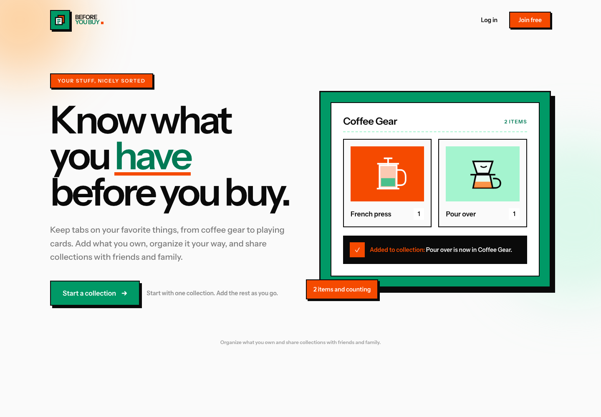

# Before You Buy

**A home for everything you already own—before another one follows you home.**

Before You Buy is a collection-tracking app for the things that are easy to forget and even easier to accidentally buy twice. Add the coffee gear, books, records, games, tools, playing cards, or wonderfully specific objects you already own. Then check your collection before making a purchase.

Collections can also be shared with friends and family, making them useful when someone is shopping for you. Less guessing, fewer duplicates, and no emergency hunt for a gift receipt.

## What it is for

- Keep personal collections organized in one place.
- Check what you own before buying something similar—or identical.
- Share collections with people you trust.
- Look through someone else's collection before choosing a gift.
- Track quantities when owning more than one is entirely reasonable.
